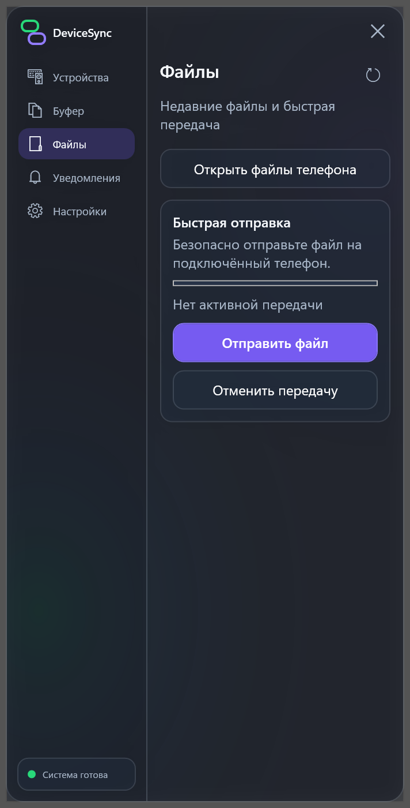
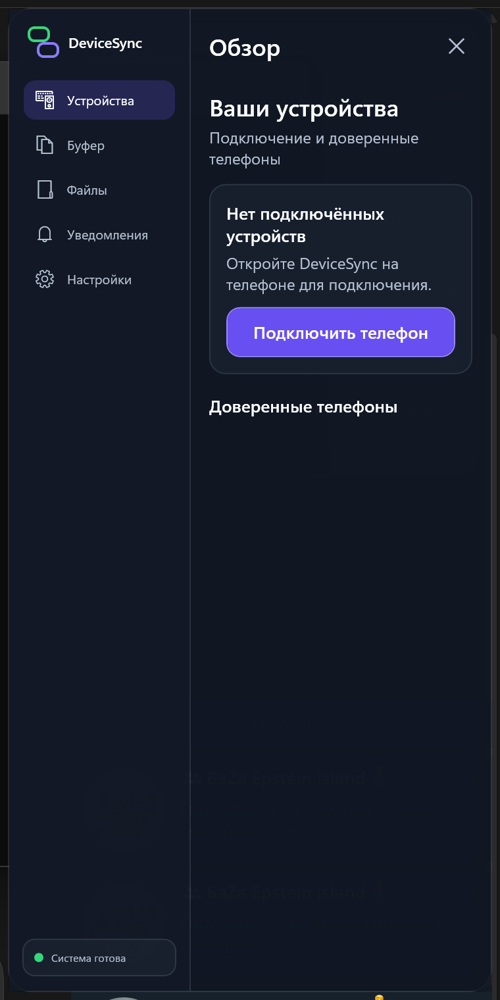
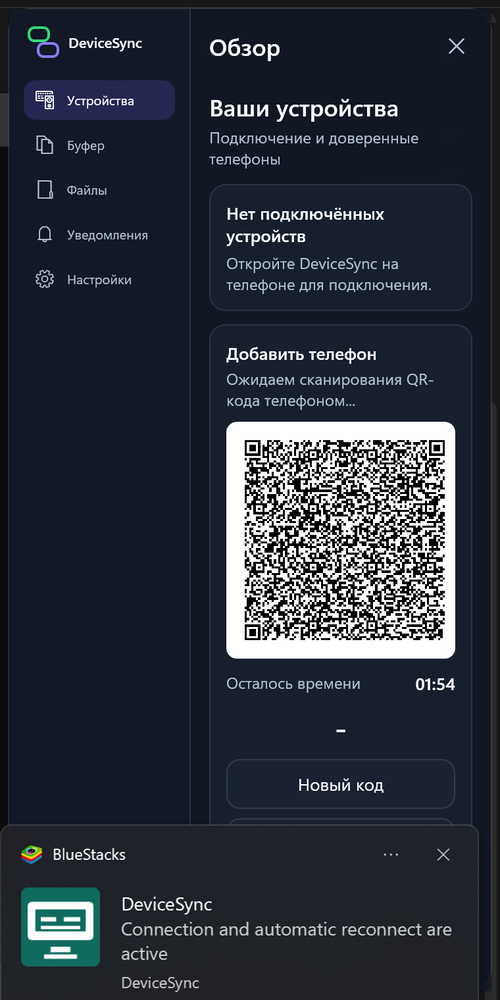
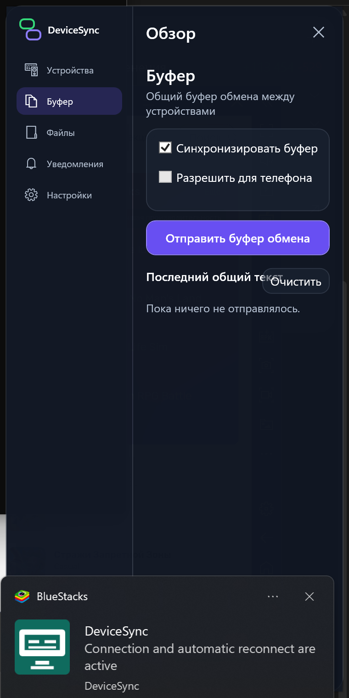
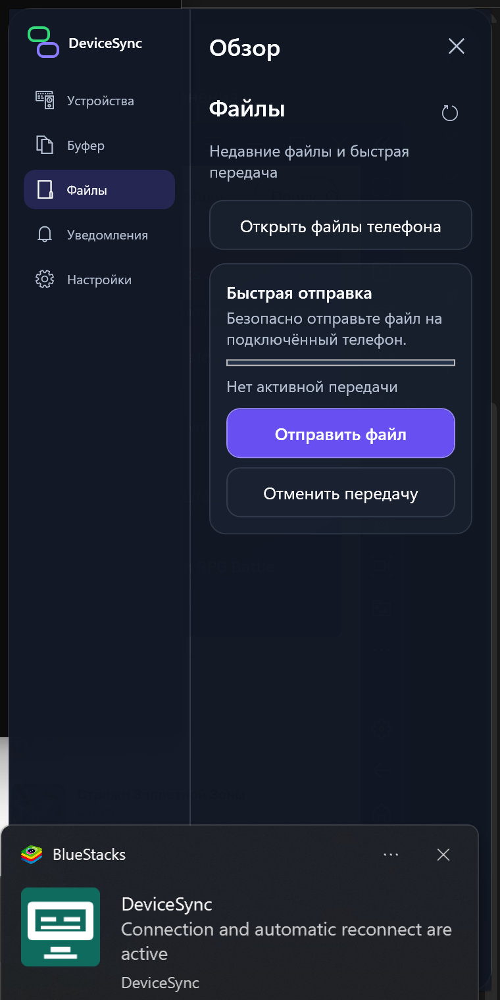
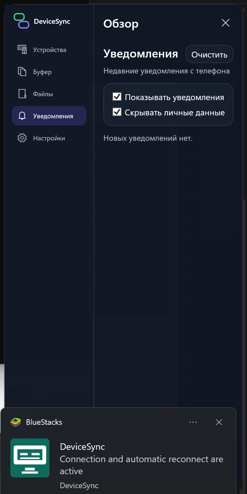
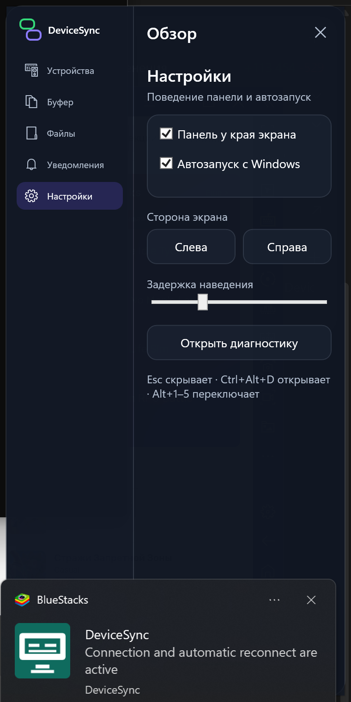

# DeviceSync для Windows

[English](README.md) | [Русский](README.ru.md)

DeviceSync напрямую связывает компьютер с Windows и Android-телефон в локальной сети. Приложение поддерживает аутентифицированное сопряжение, возобновляемую передачу файлов, общий буфер обмена, уведомления телефона и доступ к разрешённым файлам без передачи повседневного трафика через облачный сервис.

<p align="center">
  
</p>

> DeviceSync активно развивается. Перед использованием для важных данных ознакомьтесь с [текущими ограничениями](#текущие-ограничения).

## Содержание

- [Возможности](#возможности)
- [Скриншоты](#скриншоты)
- [Требования](#требования)
- [Установка и запуск](#установка-и-запуск)
- [Сборка из исходного кода](#сборка-из-исходного-кода)
- [Сопряжение телефона](#сопряжение-телефона)
- [Основные сценарии](#основные-сценарии)
- [Архитектура](#архитектура)
- [Безопасность и конфиденциальность](#безопасность-и-конфиденциальность)
- [Разработка и тестирование](#разработка-и-тестирование)
- [Решение проблем](#решение-проблем)
- [Текущие ограничения](#текущие-ограничения)
- [Участие в разработке и лицензирование](#участие-в-разработке-и-лицензирование)

## Возможности

Windows-приложение выступает настольной частью DeviceSync. Оно принимает аутентифицированное подключение Android, объявляет себя в локальной сети и предоставляет согласованные функции через WPF-интерфейс и необязательную панель у края экрана.

Реализованные возможности:

- автоматическое обнаружение через mDNS/DNS-SD и UDP-маяк, а также ручное подключение по IP с Android;
- QR-сопряжение с проверкой и постоянными идентификаторами доверенных устройств;
- TLS 1.2/1.3, проверка SPKI pin на Android и подписанное прикладное рукопожатие;
- двусторонняя потоковая передача файлов с SHA-256 и возобновлением по протоколу V2;
- ручная и включаемая пользователем автоматическая передача текстового буфера с защитой от циклов;
- пересылка Android-уведомлений с фильтрацией приложений и настройками приватности;
- просмотр разрешённых медиафайлов и папок Android, миниатюр и загрузка на Windows;
- экспериментальная синхронизация папок;
- переподключение через LAN, точку доступа, USB-модем и более медленный Bluetooth RFCOMM fallback;
- русский и английский интерфейс, работа в трее, автозапуск, диагностика и боковая панель.

Доступность функций согласуется при каждом подключении. Элемент интерфейса может быть недоступен, если Android-сборка не объявила соответствующую capability.

## Скриншоты

<p align="center">
  
  
  
</p>

<p align="center">
  
  
  
</p>

## Требования

| Сценарий | Требование |
|---|---|
| Запуск опубликованной сборки | 64-битная Windows 10 или Windows 11; совместимое Android-приложение DeviceSync |
| Подключение по LAN | Оба устройства в одной доступной частной сети; TCP-порт `54321` разрешён для DeviceSync |
| Сборка из исходников | .NET 8 SDK и PowerShell |
| Создание установщика | Inno Setup 6, `ISCC.exe` доступен через `PATH` |
| Bluetooth fallback | Bluetooth и предварительное системное сопряжение ПК и телефона |

Опубликованная Windows-сборка является self-contained и не требует отдельной установки .NET Desktop Runtime. Для разработки нужен .NET 8 SDK.

## Установка и запуск

Готовые EXE и ZIP намеренно исключены из Git. Используйте проверенный релиз владельца репозитория, когда он опубликован, либо соберите приложение локально.

Запуск уже существующей локальной публикации:

```powershell
.\release-current\DeviceSync.App.exe
```

Скрипт, который пересобирает последнюю Release-версию и запускает её:

```powershell
.\windows\Run-DeviceSync-Latest.ps1
```

> Неподписанная локальная сборка может вызвать предупреждение Microsoft Defender SmartScreen. Проверяйте происхождение файла и не обходите предупреждение для недоверенной загрузки.

## Сборка из исходного кода

Выполните из корня репозитория:

```powershell
dotnet restore .\windows\DeviceSync.sln
dotnet build .\windows\DeviceSync.sln -c Debug
dotnet run --project .\windows\src\DeviceSync.App\DeviceSync.App.csproj
```

Запуск всех Windows-тестов:

```powershell
dotnet test .\windows\DeviceSync.sln -c Debug
```

Создание протестированной self-contained сборки `win-x64`:

```powershell
.\scripts\build-release.ps1
```

Результат:

```text
release-current\DeviceSync.App.exe
```

Сборка вместе с установщиком:

```powershell
.\scripts\build-release.ps1 -BuildInstaller
```

| Результат | Назначение |
|---|---|
| Debug | Быстрая локальная разработка и отладка; файлы появляются в каталогах `bin` проектов |
| Release | Оптимизированная компиляция для тестов и ручного запуска |
| Published build | Self-contained single-file ReadyToRun-приложение `win-x64` в `release-current` |

`bin`, `obj`, `windows/artifacts`, `windows/DeviceSync-current` и `release-current` — генерируемые результаты, их нельзя коммитить.

## Сопряжение телефона

1. Установите совместимые версии DeviceSync на Windows и Android.
2. Подключите устройства к одной частной локальной сети и сначала запустите Windows-приложение.
3. Откройте **Устройства** и нажмите **Подключить телефон**, чтобы создать временный QR-код.
4. На Android выберите **Добавить компьютер**, разрешите камеру и отсканируйте код.
5. Проверьте данные сопряжения на обоих устройствах и подтвердите запрос.
6. Включите фоновое подключение Android, если после закрытия интерфейса нужны переподключение, уведомления и очереди передачи.

Windows объявляет сервис `_devicesync._tcp` и обычно слушает TCP `54321`. Обнаружение находит только адрес; доверие устанавливают QR-данные, TLS pinning и подписанная проверка идентичности.

## Основные сценарии

### Отправка файла

Откройте **Файлы**, нажмите **Отправить файл** и выберите подключённый телефон. Получатель подтверждает предложение, если явная политика доверенного устройства не разрешает автоматический приём. Данные передаются потоком, проверяются SHA-256 и могут возобновляться по checkpoint при поддержке V2.

### Общий буфер обмена

В разделе **Буфер** используйте **Отправить буфер обмена** для ручной передачи. Автоматическая синхронизация включается отдельно и может настраиваться для доверенного телефона. Пустые и приватные значения не должны пересылаться.

### Просмотр файлов телефона

Откройте **Файлы** и нажмите **Открыть файлы телефона**. Android должен разрешить доступ к медиа, всем файлам или выбранной пользователем папке. Страницы каталога и миниатюры имеют ограничения по размеру и передаются внутри аутентифицированной сессии.

### Получение уведомлений Android

Разрешите доступ к уведомлениям на Android и настройте список приложений. Windows показывает историю и системные уведомления, может скрывать чувствительное содержимое и блокировать отдельные пакеты.

### Боковая панель и автозапуск

В **Настройках** включаются панель у края экрана, её сторона, задержка наведения и автозапуск. `Esc` скрывает панель, `Ctrl+Alt+D` открывает её, `Alt+1`–`Alt+5` переключают разделы.

## Архитектура

```text
windows/
├── src/DeviceSync.Protocol        Фреймы, payload, capabilities, negotiation
├── src/DeviceSync.Application     Сопряжение, доверие, файлы, буфер, уведомления
├── src/DeviceSync.Infrastructure  TCP/TLS, Bluetooth, discovery, хранение данных
├── src/DeviceSync.App             WPF UI, DI, трей и боковая панель
├── tests/                          Модульные и loopback-интеграционные тесты
└── installer/                      Конфигурация Inno Setup
protocol/                           Межплатформенные спецификации и test vectors
scripts/                            Автоматизация релизной сборки
```

`TcpDeviceServer`/`ClientSession` владеет циклом чтения нормальной сессии и маршрутизирует проверенные сообщения feature-менеджерам. Android следует тому же принципу единственного reader. Фрейм состоит из четырёхбайтовой длины big-endian и UTF-8 JSON. Версия протокола и capabilities согласуются до включения функций.

## Безопасность и конфиденциальность

- Обычный LAN-транспорт использует TLS 1.2 или 1.3.
- QR-код содержит SPKI fingerprint TLS-сервера Windows; Android закрепляет его до подключения.
- Долгоживущие ECDSA-идентичности и подписанный challenge/response защищают переподключение.
- Windows защищает закрытые ключи средствами защиты данных текущего пользователя и хранит доверие/настройки в Local AppData.
- Файлы сначала пишутся во временное хранилище; размеры и смещения проверяются, перед завершением сверяется SHA-256.
- Уведомления, автоматический буфер, файловая автоматизация и каталог телефона требуют явного выбора пользователя.
- Диагностика должна скрывать текст буфера, уведомлений, пути, секреты и идентификаторы.

DeviceSync обрабатывает чувствительные данные. Сопрягайте только собственные устройства, проверяйте разрешения каждого устройства и используйте доверенную частную сеть.

### Используемый доступ Windows

| Доступ | Зачем нужен |
|---|---|
| Входящий TCP в частной сети | Приём аутентифицированного Android-подключения на порту `54321` |
| Local AppData | Настройки, доверенные идентичности, очереди, checkpoints и защищённые ключи |
| Выбранные файлы и папки | Отправка, подтверждённый приём и настроенная синхронизация папок |
| Буфер обмена | Ручная или включённая пользователем автоматическая передача текста |
| Область уведомлений и автозапуск | Фоновая работа и переподключение |
| Bluetooth по выбору | Медленный RFCOMM fallback после системного сопряжения |

## Разработка и тестирование

Solution содержит тесты протокола, прикладного слоя, UI и loopback-интеграции. Основная релизная проверка:

```powershell
dotnet test .\windows\DeviceSync.sln -c Release
.\scripts\build-release.ps1
```

Изменение протокола должно сопровождаться обновлением спецификаций, общих JSON-векторов в `protocol/test-vectors` и тестов обеих платформ. См. [release checklist](docs/RELEASE_CHECKLIST.md) и [описание транспорта](docs/TRANSPORT_ARCHITECTURE.md).

## Решение проблем

### Android видит ПК, но не подключается

Проверьте listener:

```powershell
Get-NetTCPConnection -LocalPort 54321
```

Разрешите DeviceSync для частных сетей в Windows Firewall. Для временной диагностики администратор может создать правило:

```powershell
New-NetFirewallRule -DisplayName "DeviceSync TCP 54321" -Direction Inbound `
  -Protocol TCP -LocalPort 54321 -Action Allow -Profile Private
```

Не отключайте брандмауэр целиком.

### Компьютер не находится автоматически

Убедитесь, что устройства находятся в одной неизолированной сети и VPN не уводит трафик на другой интерфейс. Если multicast заблокирован, используйте ручной ввод IP на Android.

### Не работает сопряжение или переподключение

Удалите старую запись доверия на обеих платформах и отсканируйте новый QR. Смена Windows-идентичности или TLS pin требует нового сопряжения.

### Останавливаются фоновые функции

Проверьте фоновое подключение Android, разрешение уведомлений и отключите оптимизацию батареи для DeviceSync, если прошивка приостанавливает приложение.

## Текущие ограничения

- Публикация настроена для `win-x64`; пакеты ARM64 и x86 не подготовлены.
- В репозитории нет подписанного публичного установщика или закоммиченного релизного EXE.
- Нужна прямая сетевая доступность; гостевая изоляция Wi-Fi, корпоративные политики и некоторые VPN блокируют соединение.
- Bluetooth — медленный резервный транспорт для буфера, команд и небольших файлов, а не массовой синхронизации.
- Синхронизация папок и клавиатура DeviceSync для Android остаются экспериментальными областями и требуют дополнительной проверки на реальных устройствах.
- Некоторые roadmap-документы могут отставать от кода; фактический набор функций определяется runtime capabilities.

Планы усиления надёжности и развития продукта находятся в [roadmap](docs/DEVICESYNC_ROADMAP.md).

## Участие в разработке и лицензирование

Перед отправкой изменения:

1. не добавляйте в Git результаты сборки;
2. добавьте или обновите тесты;
3. при изменении wire-протокола обновите документы и test vectors;
4. запустите Release-тесты;
5. опишите влияние на безопасность, разрешения и миграцию.

В корне пока нет файла `LICENSE`, поэтому общая лицензия на повторное использование не указана. Перед распространением или использованием кода получите разрешение владельца. Сторонние компоненты перечислены в [THIRD_PARTY_NOTICES.md](THIRD_PARTY_NOTICES.md).

Связанный Android-репозиторий: [Lyrathorne/Android-sync-app](https://github.com/Lyrathorne/Android-sync-app).
